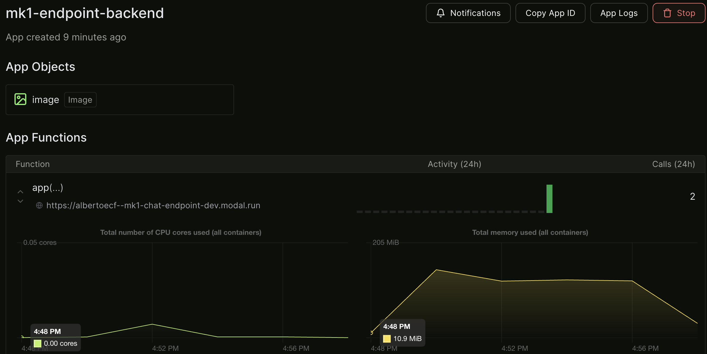

## Intro 
[MK1](https://mk1.ai/blog/flywheel-launch?_gl=1*1r6qzwz*_ga*NDc3OTE1NjY4LjE3MDkyMzUxMzc.*_ga_G1XWZE50S3*MTcwOTQ2ODYyMy40LjEuMTcwOTQ2OTMxOS4wLjAuMA..) offers a powerful solution for high-performance inference with effortless setup. In this guide, we'll explore how to leverage [MK1 - Flywheel](https://mk1.ai/blog/flywheel-launch?_gl=1*1r6qzwz*_ga*NDc3OTE1NjY4LjE3MDkyMzUxMzc.*_ga_G1XWZE50S3*MTcwOTQ2ODYyMy40LjEuMTcwOTQ2OTMxOS4wLjAuMA..) for seamless inference using the [Mixtral 8x7B Instruct](https://blog.unrealspeech.com/mixtral-8x7b-instruct-comprehensive-guide/#:~:text=1%3F-,Mixtral%2D8x7B%2DInstruct%2Dv0.,produce%20high%2Dquality%20text%20outputs.) model.

We will cover the following steps 
* Setup
* Models
* Endpoint
* Deploy on modal
* Client example


### Setup 

Import packages
```
import modal
from typing import List
from pydantic import BaseModel

```

We will define the following variables to configure our execution

* MODEL_TO_USE:  [Mixtral 8x7B Instruct](https://blog.unrealspeech.com/mixtral-8x7b-instruct-comprehensive-guide/#:~:text=1%3F-,Mixtral%2D8x7B%2DInstruct%2Dv0.,produce%20high%2Dquality%20text%20outputs.) generative model designed to produce high-quality text outputs 
* [IMAGE_TO_USE](https://modal.com/docs/reference/modal.Image): Utilize the Debian Slim container image, which serves as the foundation for running functions smoothly
* GPU_CONFIG: Configure the system with [Nvidia A10G](https://modal.com/pricing) for accelerated performance.

We declare them in a python file 

```
MODEL_TO_USE ="mk1-flywheel-latest-mistral-7b-instruct"
IMAGE_TO_USE = modal.Image.debian_slim()
GPU_CONFIG = modal.gpu.A10G()
```


## Models: 
* In the Models section, we define the key data structures—GenerationRequest, GenerationResponseSample, and GenerationResponse—that facilitate communication with the MK1 Flywheel engine, enabling efficient text generation and processing. 

The GenerationRequest class defines parameters that can be adjusted for the request. It receives a text string as input and allows setting various properties such as max_tokens, temperature, etc.

```
class GenerationRequest(BaseModel):
    text: str
    max_tokens: int
    eos_token_ids: List[int] = []
    max_input_tokens: int = 0
    num_samples: int = 1
    stop: List[str] = []
    temperature: float = 1.0
    top_k: int = 50
    top_p: float = 1.0
    presence_penalty: float = 0.0
    frequency_penalty: float = 0.0
```

The GenerationResponseSample class represents a single response generated by the model. It includes properties like the generated text, the number of generated tokens, the finishing time, and the reason for finishing.

```
class GenerationResponseSample(BaseModel):
    text: str
    generated_tokens: int
    finished: float
    finish_reason: str
```

The GenerationResponse class represents a response containing one or more samples of generated text. It includes properties like the creation time, the number of samples, and a list of GenerationResponseSample instances.

```
class GenerationResponse(BaseModel):
    created: float
    finished: float
    num_samples: int
    responses: List[GenerationResponseSample]
````


## Implement FastAPI

We start by initializing the FastAPI application 
and defining the necessary routes: for health status, statistics, and text generation. The `/generate` endpoint processes requests for text generation based on the provided payload. Check source code for `/heatlh` and `/stats`.


The following code creates a Modal application called "mk1-endpoint-backend" using a specified image. [Read more](https://modal.com/docs/reference/modal.Stub#modalstub)

````
stub = modal.Stub(
    "mk1-endpoint-backend",
    image=IMAGE_TO_USE,
)
````

Next code snippet defines a FastAPI application designed for text generation utilizing Modal's MK1 Flywheel. It configures the application to keep one container warmed up, allowing concurrent inputs up to 512, with a timeout set to 600 seconds. The application receives requests and generates text based on the provided payload, utilizing a pre-configured model from the MK1 workspace. The generated text is then returned as a response.

````
@stub.function(
    keep_warm=1,
    allow_concurrent_inputs=512,
    timeout=600,
)
@modal.asgi_app(label="mk1-chat-endpoint")
def app():
    """Creates a FastAPI application for text generation using MK1 Flywheel.

    Returns:
        fastapi.FastAPI: The FastAPI application for text generation.
    """
    import modal
    import fastapi
    import fastapi.staticfiles

    web_app = fastapi.FastAPI()
    Model = modal.Cls.lookup(
        MODEL_TO_USE, "Model", workspace="mk1"
    ).with_options(
        gpu=GPU_CONFIG,
        timeout=600,
    )
    model = Model()

    @web_app.post("/generate")
    async def generate(request: fastapi.Request) -> fastapi.Response:
        """Endpoint for generating text based on the request payload.

        Args:
            request (fastapi.Request): The request containing generation parameters.

        Returns:
            fastapi.Response: The response containing generated text.
        """
        content_type = request.headers.get("Content-Type")
        if content_type != "application/json":
            return fastapi.Response(
                content="",
                status_code=fastapi.status.HTTP_415_UNSUPPORTED_MEDIA_TYPE,
                media_type="text/plain",
            )

        request_data = await request.json()
        generation_request = GenerationRequest(**request_data)
        response = model.generate.remote(**generation_request.dict())
        return GenerationResponse(**response)

    return web_app

````

### Modal Serve

To run this app locally, simply execute the following command:

```bash
modal serve views.py
```

Deploying a Web Server
For deploying our application and creating a persistent web endpoint in the cloud, execute the following command:

```bash
modal deploy
```

## Use our brand new endpoint

We will create some python code to interact with our new endpoint as some client app could do it

First, import libraries 
````
import requests
import json
from typing import Dict, Any
````

Then we define the url, headers and data we want to send to the endpoint
````
base_url = "https://albertoecf--mk1-chat-endpoint-dev.modal.run"
url = f"{base_url}/generate"
headers = {"Content-Type": "application/json"}
data = {
    "text": "What is the difference between a llama and an alpaca?",
    "max_tokens": 512,
    "eos_token_ids": [1, 2],
    "temperature": 0.8,
    "top_k": 50,
    "top_p": 1.0,
}
````


🚧 Replace base_url with your actual url (check the ouput of `modal serve views.py`) (you can also fin this value in modal panel, see bonus section)

Finally execute the request

````
# Function to make the POST request
def make_post_request(
    url: str, headers: Dict[str, str], data: Dict[str, Any]
) -> Dict[str, Any]:
    """Make a POST request to the specified URL."""
    response = requests.post(url, headers=headers, data=json.dumps(data))
    response.raise_for_status()  # Raise an exception for bad status codes

    return response.json()

# Making the POST request
try:
    response_data = make_post_request(url, headers, data)
    print(response_data)
except requests.exceptions.HTTPError as err:
    print(f"HTTP error occurred: {err}")
except requests.exceptions.RequestException as e:
    print(f"An error occurred: {e}")
````

After some seconds you will recive the answer. Note, that the first request might take a few seconds to account for the coldstart, but subsequent calls will be faster.

## Bonus

1. Instead of creating a client file, we could simply curl to the endpoint to engage with the model (remember to replace the url)
    ````
    curl -X "POST" "https://albertoecf--mk1-chat-endpoint-dev.modal.run/generate" -H 'Content-Type: application/json' -d '{
    "text": "What is the difference between a llama and an alpaca?",
    "max_tokens": 512,
    "eos_token_ids": [1, 2],
    "temperature": 0.8,
    "top_k": 50,
    "top_p": 1.0
    }'
    ````
2. Check app & deployment stats on `modal.com/your_github_user_name/apps`. Here you will find the billing period, activity, calls and more.
   

### Todo
* Deploy and invoke the model
